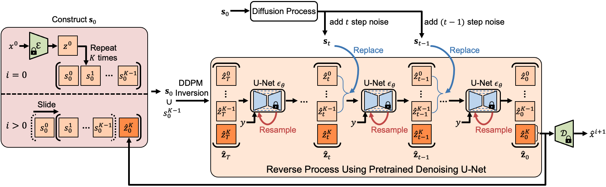

<!--
Copyright (C) 2024 Mitsubishi Electric Research Laboratories (MERL)

SPDX-License-Identifier: AGPL-3.0-or-later
-->

# TI2V-Zero (CVPR 2024)

This repository contains the implementation of the paper:
> **TI2V-Zero: Zero-Shot Image Conditioning for Text-to-Video Diffusion Models"**<br>
> [Haomiao Ni](https://nithin-gk.github.io/), [Bernhard Egger](https://eggerbernhard.ch/) [Suhas Lohit](https://www.merl.com/people/slohit), [Anoop Cherian](https://www.merl.com/people/cherian), [Ye Wang](https://www.merl.com/people/yewang), [Toshiaki Koike-Akino](https://www.merl.com/people/koike), [Sharon X. Huang](https://faculty.ist.psu.edu/suh972/), [Tim K Marks](https://www.merl.com/people/tmarks)

IEEE/CVF Conference on Computer Vision and Pattern Recognition (**CVPR**), 2024

[[Project Page](https://www.merl.com/demos/TI2V-Zero)]

## Summary

<div align=center></div>

Text-conditioned image-to-video generation (TI2V) aims to synthesize a realistic video starting from a given image (\eg, a woman's photo) and a text description e.g., "a woman is drinking water". Existing TI2V frameworks often require costly training on video-text datasets and specific model designs for text and image conditioning. In this work, we propose TI2V-Zero, a zero-shot, tuning-free method that empowers a pretrained text-to-video (T2V) diffusion model to be conditioned on a provided image, enabling TI2V generation without any optimization, fine-tuning, or introducing external modules. Our approach leverages a pretrained T2V diffusion foundation model as the generative prior. To guide video generation with the additional image input, we propose a "repeat-and-slide" strategy that modulates the reverse denoising process, allowing the frozen diffusion model to synthesize a video frame-by-frame starting from the provided image. To ensure temporal continuity, we employ a DDPM inversion strategy to initialize Gaussian noise for each newly synthesized frame and a resampling technique to help preserve visual details. We conduct comprehensive experiments on both domain-specific and open-domain datasets, where TI2V-Zero consistently outperforms a recent open-domain TI2V model. Furthermore, we show that TI2V-Zero can seamlessly extend to other tasks such as video infilling and prediction when provided with more images. Its autoregressive design also supports long video generation.

## Quick Start
----
1. Install required dependencies. First create a conda environment using `conda create --name ti2v python=3.8`. Activate the conda environment using `conda activate ti2v`. Then use `pip install -r requirements.txt` to install the remaining dependencies.
2. Run `python initialization.py` to download pretrained [ModelScope](https://modelscope.cn/models/iic/text-to-video-synthesis/summary) models from [HuggingFace](https://huggingface.co/ali-vilab/modelscope-damo-text-to-video-synthesis).
3. Run `python demo_img2vid.py` to generate videos by providing an image and a text input.

You can set the image path and text input in this file manually. By default, the file uses example images and text inputs. The example images in the `examples/` folder were generated using [Stable Diffusion](https://github.com/CompVis/stable-diffusion)

## Generating Videos using Public Datasets
----
**MUG Dataset**
1. Download MUG dataset from their [website](https://mug.ee.auth.gr/fed/).
2. After installing dependencies, run `python gen_video_mug.py` to generate videos. Please set the paths in the code files if needed.

**UCF101 Dataset**
1. Download UCF101 dataset from their [website](https://www.crcv.ucf.edu/data/UCF101.php).
2. Preprocess the dataset to sample frames from video. You may use our preprocessing function in `datasets_ucf.py`.
3. After installing dependencies, run `python gen_video_ucf.py` to generate videos. Please set the paths in the code files if needed.

## Contributing

See [CONTRIBUTING.md](CONTRIBUTING.md) for our policy on contributions.

## License

Released under `AGPL-3.0-or-later` license, as found in the [LICENSE.md](LICENSE.md) file.

All files, except as noted below:
```
Copyright (c) 2024 Mitsubishi Electric Research Laboratories (MERL)
SPDX-License-Identifier: AGPL-3.0-or-later
```

The following files

* `autoencoder.py`
* `diffusion.py`
* `modelscope_t2v.py`
* `unet_sd.py`

were adapted from https://github.com/modelscope/modelscope/tree/57791a8cc59ccf9eda8b94a9a9512d9e3029c00b/modelscope/models/multi_modal/video_synthesis (license included in [LICENSES/Apache-2.0.txt](LICENSES/Apache-2.0.txt)):

```
Copyright (c) 2024 Mitsubishi Electric Research Laboratories (MERL)
Copyright (c) 2021-2022 The Alibaba Fundamental Vision Team Authors
```

The following file

* `modelscope_t2v_pipeline.py`

was adapted from https://github.com/modelscope/modelscope/blob/bedec553c17b7e297da9db466fee61ccbd4295ba/modelscope/pipelines/multi_modal/text_to_video_synthesis_pipeline.py (license included in [LICENSES/Apache-2.0.txt](LICENSES/Apache-2.0.txt))

```
Copyright (c) 2024 Mitsubishi Electric Research Laboratories (MERL)
Copyright (c) Alibaba, Inc. and its affiliates.
```

The following file

* `util.py`

was adapted from https://github.com/modelscope/modelscope/blob/57791a8cc59ccf9eda8b94a9a9512d9e3029c00b/modelscope/models/cv/anydoor/ldm/util.py (license included in [LICENSES/Apache-2.0.txt](LICENSES/Apache-2.0.txt)):

```
Copyright (c) 2024 Mitsubishi Electric Research Laboratories (MERL)
Copyright (c) 2021-2022 The Alibaba Fundamental Vision Team Authors. All rights reserved.
```

The following files:

* `dataset/datasets_mug.py`
* `dataset/datasets_ucf.py`

were adapted from [LFDM](https://github.com/nihaomiao/CVPR23_LFDM/tree/main/preprocessing) (license included in [LICENSES/BSD-2-Clause.txt](LICENSES/BSD-2-Clause.txt)):

```
Copyright (c) 2024 Mitsubishi Electric Research Laboratories (MERL)
Copyright (C) 2023 NEC Laboratories America, Inc. ("NECLA"). All rights reserved.
```

The following files

* `demo_img2vid.py`
* `gen_video_mug.py`
* `gen_video_ucf.py`

were adapted from [LFDM](https://github.com/nihaomiao/CVPR23_LFDM/tree/main/demo) (license included in [LICENSES/BSD-2-Clause.txt](LICENSES/BSD-2-Clause.txt)):

```
Copyright (c) 2024 Mitsubishi Electric Research Laboratories (MERL)
Copyright (C) 2023 NEC Laboratories America, Inc. ("NECLA"). All rights reserved.
```

## Citation
If you use our work, please use the following citation


```bibTex
@inproceedings{ni2024ti2v,
  title={TI2V-Zero: Zero-Shot Image Conditioning for Text-to-Video Diffusion Models},
  author={Ni, Haomiao and Egger, Bernhard and Lohit, Suhas and Cherian, Anoop and Wang, Ye and Koike-Akino, Toshiaki and Huang, Sharon X and Marks, Tim K},
  booktitle={Proceedings of the IEEE/CVF Conference on Computer Vision and Pattern Recognition},
  year={2024}
}
```
